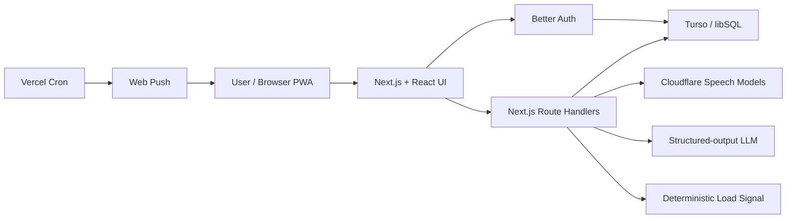

# Echly

> **Language note:** This README is presented in English first, followed by Japanese in each section. English is the primary language for international judges.


Echly is a voice-first AI assistant that understands your daily workload and reshapes tomorrow into a plan you can realistically handle.

Echlyは、声と自己評価からその日の負荷を捉え、明日の仕事量を無理なく整える音声チェックイン型AIアシスタントです。

## 1. Overview（概要）

### English

When people are tired, even maintaining a task manager can feel like another task. With Echly, users simply talk about their day and what they need to do tomorrow. Echly transcribes the recording, structures tasks and concerns, estimates a non-medical workload signal, and proposes a realistic plan that protects important commitments while creating room to recover.

The workload signal combines self-reported demand, sleepiness, and changes from the user's own voice baseline. Echly never presents this as a medical diagnosis, and consequential actions remain subject to explicit user approval.

### 日本語

疲れている夜に、複雑なタスク管理画面を操作する必要はありません。Echlyに「今日どうだったか」「明日何をするか」を話すと、音声を文字起こしし、予定・タスク・気がかりを構造化します。さらに、主観的負荷、眠気、本人の過去音声との変化を組み合わせて負荷シグナルを算出し、重要な予定を守りながら翌日の余白を作るプランを提案します。

負荷シグナルは医療診断ではなく、働き方を見直すための参考情報です。また、重要な操作はユーザーの明示的な承認を前提とします。

## 2. Problem（解決したい課題）

### English

- The more exhausted people become, the harder it is to capture, classify, and prioritize their work.
- People often underestimate their own workload and continue overfilling the next day.
- Many well-being products visualize a condition but do not help reduce the actual work causing it.
- Rescheduling meetings and drafting considerate messages carry emotional and cognitive costs.

Echly connects reflection to action. It does not stop at “how are you feeling?” It helps decide what to protect, what to move, and where recovery time should be placed.

### 日本語

- 疲れているほど、タスクの入力・分類・優先順位付けが難しくなる。
- 自分の負荷を過小評価したまま、翌日にも予定を詰め込んでしまう。
- 一般的なウェルビーイング製品は状態の可視化で止まり、実際の仕事量の調整にはつながりにくい。
- 会議の延期や連絡文の作成には心理的コストがあり、必要だと分かっていても後回しになりやすい。

Echlyは「状態を測る」だけでなく、「明日何を守り、何を動かし、どこで休むか」という意思決定までを一つの体験にします。

## 3. Features（機能）

### English

- Voice check-ins powered by the browser MediaRecorder API
- A two-step flow for today's reflection and tomorrow's plans
- Japanese and English transcription with review and correction for uncertain results
- Structured extraction of tasks, events, deadlines, times, people, importance, and movability
- A workload signal combining six NASA-TLX-inspired questions, sleepiness, and voice trends
- Personal voice-baseline comparison after five eligible recordings
- Tomorrow plans containing keep, move, reschedule, rest-block, and email-draft suggestions
- A review and approval screen before consequential actions
- Daily history with transcripts, extracted tasks, workload details, and trend charts
- Google OAuth and email/password authentication with Better Auth
- Per-user persistence in Turso without storing raw audio recordings
- Automatic browser-language detection plus manual Japanese/English switching
- PWA support and a daily Web Push reminder at 8:00 PM in the user's time zone
- A controlled demo fallback when an external AI service is unavailable

### 日本語

- ブラウザのMediaRecorderを使った音声チェックイン
- 今日の振り返りと明日の予定を分けて入力できる2ステップフロー
- 日本語・英語の音声文字起こしと、低信頼時の確認・修正UI
- 発話からタスク、予定、期限、時刻、関係者、重要度、移動可否を構造化抽出
- NASA-TLXを参考にした6項目の自己評価、眠気、音声傾向を組み合わせた負荷シグナル
- 5件以上の有効な音声記録を使う個人内ベースライン比較
- 維持・移動・延期・休息ブロック・メール下書きを含む翌日プラン
- 重要な操作前に内容を確認する承認画面
- 文字起こし、抽出タスク、負荷詳細、推移グラフを確認できる日別履歴
- Better AuthによるGoogle OAuthおよびメール／パスワード認証
- Tursoへのユーザー別データ保存。生の録音音声は保存しない
- 端末言語の自動判定と日本語／英語の手動切替
- PWA対応と、端末タイムゾーンの20:00に合わせたWeb Push通知
- 外部AIサービスが利用できない場合の制御されたデモフォールバック

## 4. Demo（デモ）

### English

**Public demo URL: To be added before submission.**

Local routes:

- Automatic language selection: `http://localhost:3000`
- Japanese: `http://localhost:3000/jp-ja`
- English: `http://localhost:3000/us-en`

Recommended demo flow:

1. Sign in with Google or an email address.
2. After 8:00 PM in the device time zone, record today's reflection and tomorrow's plans. The debug time-zone setting can be used during judging.
3. Review and, if necessary, correct the transcription.
4. Inspect the extracted tasks, workload signal, and supporting evidence.
5. Generate a tomorrow plan with protected commitments, rescheduling options, recovery blocks, and message drafts.
6. Select the actions to approve on the review screen.
7. Open History to inspect the saved daily result and workload trend.

Sample prompt:

> Tomorrow I have a budget meeting with Acme at 10 AM, need to finish the proposal deck in the afternoon, and have a brainstorm with Chris at 5 PM. I barely slept last night and I'm having trouble focusing.

### 日本語

**公開デモURL: 提出前に追記してください。**

ローカルURL:

- 自動言語判定: `http://localhost:3000`
- 日本語: `http://localhost:3000/jp-ja`
- English: `http://localhost:3000/us-en`

推奨デモフロー:

1. Googleまたはメールアドレスでログインする。
2. 端末時刻の20:00以降に「今日の振り返り」と「明日の予定・タスク」を録音する。審査時は設定画面のデバッグ用タイムゾーンを利用できる。
3. 文字起こしを確認し、必要なら編集して確定する。
4. 抽出されたタスクと負荷シグナル、その根拠を確認する。
5. 翌日プランを生成し、守る予定、延期候補、休息ブロック、連絡文案を確認する。
6. 承認画面で実行対象を選択する。
7. 履歴画面で日別の結果と負荷推移を確認する。

サンプル発話:

> 明日は10時にA社の予算会議。午後は資料の仕上げ、17時からCさんとブレスト。でも、今日はほとんど寝てなくて、正直もう頭が回らない。

## 5. Tech Stack（技術構成）

### English

| Area | Technology |
| --- | --- |
| Web | Next.js 16 App Router, React 19, TypeScript |
| UI | HeroUI, Tailwind CSS v4, Lucide React |
| AI orchestration | Next.js Route Handlers, Zod Structured Outputs |
| Runtime AI | Cloudflare Workers AI; default: `@cf/openai/gpt-oss-20b` |
| Speech-to-text | Deepgram Nova 3 with Whisper Large v3 Turbo fallback |
| OpenAI integration | OpenAI Node SDK and GPT-5.6 client configuration |
| Authentication | Better Auth, Google OAuth, email/password |
| Database | Turso/libSQL, Kysely |
| Notifications | Web Push, VAPID, Vercel Cron |
| Validation | Zod |
| Deployment | Vercel |

### 日本語

| 分類 | 技術 |
| --- | --- |
| Web | Next.js 16 App Router、React 19、TypeScript |
| UI | HeroUI、Tailwind CSS v4、Lucide React |
| AIオーケストレーション | Next.js Route Handlers、Zod Structured Outputs |
| 実行時AI | Cloudflare Workers AI、既定: `@cf/openai/gpt-oss-20b` |
| 音声文字起こし | Deepgram Nova 3、Whisper Large v3 Turboのフォールバック |
| OpenAI連携 | OpenAI Node SDK、GPT-5.6用クライアント設定 |
| 認証 | Better Auth、Google OAuth、メール／パスワード |
| データベース | Turso/libSQL、Kysely |
| 通知 | Web Push、VAPID、Vercel Cron |
| バリデーション | Zod |
| デプロイ | Vercel |

## 6. Architecture（システム構成）

### English

Echly separates browser capture, authenticated API orchestration, deterministic workload scoring, AI inference, and persistence as follows:



1. The browser records audio and measures duration, volume, and silence ratio.
2. `/api/transcribe` compares speech-recognition candidates and requests confirmation when quality is uncertain.
3. `/api/analyze` extracts structured tasks, while deterministic server logic calculates the workload score.
4. `/api/plan` considers only actionable tasks for tomorrow and returns a schema-validated plan.
5. Approved results, check-ins, transcripts, schedules, and preferences are stored in Turso under the authenticated user ID.

### 日本語

1. ブラウザで録音し、録音時間・音量・無音率などの特徴を計測する。
2. `/api/transcribe` が複数の音声認識候補を比較し、信頼度が低い場合はユーザー確認を要求する。
3. `/api/analyze` が発話からタスクを構造化し、サーバー側の決定論的ロジックが負荷スコアを計算する。
4. `/api/plan` が明日実行すべき項目だけを対象に、スキーマ検証済みの翌日プランを返す。
5. 承認結果、チェックイン、文字起こし、予定、設定を認証済みユーザーID単位でTursoへ保存する。

## 7. Installation（セットアップ）

### English

Prerequisites:

- Node.js 20.9 or later
- npm
- A Turso database
- A Google OAuth client
- A Cloudflare account with Workers AI access

```bash
git clone https://github.com/NEXRO-dev/build-week-app.git
cd build-week-app/project
npm ci
```

Generate a session secret:

```bash
openssl rand -base64 48
```

After configuring the environment variables, create the Better Auth tables:

```bash
npx auth@latest migrate
```

Echly-specific tables are created and upgraded automatically on the first authenticated workspace request. Register the following Google OAuth redirect URI for local development:

```text
http://localhost:3000/api/auth/callback/google
```

Use the deployed origin instead of `http://localhost:3000` in production.

### 日本語

前提:

- Node.js 20.9以降
- npm
- Tursoデータベース
- Google OAuthクライアント
- Cloudflare Workers AIを利用できるアカウント

上記コマンドで依存関係をインストールし、セッション用シークレットを生成します。環境変数の設定後に `npx auth@latest migrate` を実行してください。Echly固有のテーブルは、認証済みワークスペースへの初回アクセス時に自動作成・更新されます。

ローカルではGoogle OAuthのリダイレクトURIに `http://localhost:3000/api/auth/callback/google` を登録し、本番ではデプロイ先のオリジンへ置き換えます。

## 8. Configuration（環境変数）

### English

Create `.env.local` in the project directory. Authentication and database variables are required. Cloudflare variables enable the live AI path. OpenAI client variables are optional in the current runtime. Web Push variables are required only when notifications are enabled.

### 日本語

プロジェクト直下に `.env.local` を作成してください。認証とデータベースの変数は必須です。Cloudflare変数はライブAI処理に使用します。現在の実行経路ではOpenAIクライアント変数は任意です。Web Push変数は通知を有効化する場合のみ必要です。

```dotenv
# Authentication / database: required
BETTER_AUTH_URL=http://localhost:3000
BETTER_AUTH_SECRET=
GOOGLE_CLIENT_ID=
GOOGLE_CLIENT_SECRET=
TURSO_DATABASE_URL=
TURSO_AUTH_TOKEN=

# Runtime AI: required for live transcription and planning
CLOUDFLARE_ACCOUNT_ID=
CLOUDFLARE_API_TOKEN=
CLOUDFLARE_TEXT_MODEL=@cf/openai/gpt-oss-20b
CLOUDFLARE_TRANSCRIPTION_MODEL=@cf/deepgram/nova-3
CLOUDFLARE_TRANSCRIPTION_FALLBACK_MODEL=@cf/openai/whisper-large-v3-turbo

# OpenAI client: optional in the current runtime path
OPENAI_API_KEY=
OPENAI_TEXT_MODEL=gpt-5.6-sol
OPENAI_TRANSCRIPTION_MODEL=gpt-4o-mini-transcribe

# Web Push: optional
NEXT_PUBLIC_VAPID_PUBLIC_KEY=
VAPID_PRIVATE_KEY=
VAPID_SUBJECT=mailto:notifications@example.com
CRON_SECRET=
```

Generate VAPID keys / VAPID鍵の生成:

```bash
npx web-push generate-vapid-keys
```

Never expose client secrets or commit `.env.local`.
秘密値をクライアントコードへ公開したり、`.env.local` をGitへコミットしたりしないでください。

## 9. Running the Project（起動方法）

### English

Start the development server:

```bash
npm run dev
```

Create and run a production build:

```bash
npm run build
npm run start
```

The app runs at `http://localhost:3000` by default. The root route uses the saved language preference first, then falls back to the browser's `Accept-Language` header.

### 日本語

開発時は `npm run dev`、本番ビルドでは `npm run build` の後に `npm run start` を実行します。デフォルトでは `http://localhost:3000` で起動します。

ルートURLは保存済みの言語設定を優先し、未設定の場合はブラウザの `Accept-Language` から日本語または英語を選択します。

## 10. Testing（テスト方法）

### English

```bash
# Unit tests with the Node.js test runner
node --test tests/*.test.mjs

# ESLint
npm run lint

# TypeScript
npx tsc --noEmit

# Production build verification
npm run build
```

The current suite covers the 8:00–11:59 PM reflection window, transcription quality and hallucination handling, audio normalization, and browser-language selection.

### 日本語

現在のテストでは、20:00から23:59までの振り返り受付時間、文字起こし品質、無音ハルシネーション対策、音声正規化、ブラウザ言語からのロケール選択を主に検証しています。上記のコマンドで、ユニットテスト、Lint、型チェック、本番ビルドを個別に実行できます。

## 11. Sample Data（サンプルデータ）

### English

Demo data and fallback logic live under `lib/demo/`:

- `sampleCheckIns.ts` contains Japanese and English sample transcripts, extracted tasks, workload results, and generated plans.
- `mockCalendar.ts` contains a mock schedule for tomorrow.

For explicitly allowed configuration or quota errors, Echly can use the typed input with its local demo analysis and plan generator. This preserves the core judging flow during a temporary external-service failure.

### 日本語

デモ用データとフォールバックロジックは `lib/demo/` にあります。

- `sampleCheckIns.ts`: 日本語・英語のサンプル発話、抽出タスク、負荷、プラン
- `mockCalendar.ts`: 翌日予定のモック

設定不足や利用上限など、明示的に許可されたエラーでは、入力テキストを使ってローカルのデモ解析・プラン生成へ切り替わります。これにより、外部サービスの一時障害時も主要な審査導線を確認できます。

## 12. How GPT-5.6 Was Used

### English

GPT-5.6 was used through Codex as a reasoning partner throughout Echly's design and implementation. It helped shape the task-extraction schema, temporal-context rules, tomorrow-plan constraints, approval safety model, bilingual UX copy, failure handling, and test cases.

The repository also includes the OpenAI Node SDK and a client configuration whose default text model is `gpt-5.6-sol`. The current live structured-extraction and planning routes, however, run through Cloudflare Workers AI. We state this distinction explicitly so development-time use is not confused with the app's current runtime provider.

Critical decisions are not delegated entirely to the model. The workload score is calculated by reproducible TypeScript logic, and every structured LLM response is validated with Zod. GPT-5.6 contributed reasoning and engineering leverage, while deterministic code protects the product's most sensitive boundaries.

### 日本語

GPT-5.6は、Echlyの設計・実装を進める推論パートナーとしてCodex経由で使用しました。音声からのタスク抽出スキーマ、時間文脈の判定ルール、翌日プランの制約、安全な承認フロー、日英UI文言、エラー処理、テストケースの検討に活用しています。

リポジトリにはOpenAI Node SDKと、`OPENAI_TEXT_MODEL=gpt-5.6-sol` を既定値とするクライアントも含まれています。ただし、現在のライブな構造化抽出・プラン生成ルートはCloudflare Workers AIを使用しています。開発時の利用とアプリ実行時の利用を混同しないよう、この区別を明記しています。

重要な判断をモデルだけに任せず、負荷スコアは再現可能なTypeScriptロジックで計算し、LLMの構造化出力はZodで検証しています。

## 13. How Codex Was Used

### English

Codex served as an engineering agent connecting product decisions, implementation, and verification:

- Implementing and debugging flows across Next.js routes and client state
- Integrating Better Auth, Turso, and schema initialization
- Designing audio preprocessing, transcription selection, and fallback behavior
- Adding bilingual routes, automatic locale detection, and translated UI copy
- Improving history URLs, daily records, settings, notifications, and mobile UI
- Continuously running TypeScript, ESLint, Node.js tests, and production builds
- Turning direct product feedback and screenshots into focused UI changes

The human owner set the product direction and made UX decisions. Codex inspected the repository, proposed bounded changes, implemented them, and returned verifiable results.

### 日本語

Codexを、仕様整理から実装、検証までをつなぐ開発エージェントとして使用しました。

- Next.jsの画面ルートとクライアント状態をまたぐ導線の実装・修正
- Better Auth、Turso、スキーマ初期化の統合とデバッグ
- 音声前処理、文字起こし品質選択、フォールバック設計
- 日英ルート、端末言語の自動判定、翻訳UIの実装
- 履歴URL、日別記録、設定、通知、モバイルUIの改善
- TypeScript、ESLint、Node.jsテスト、本番ビルドによる継続的な検証
- プロダクトフィードバックやスクリーンショットを反映したUI修正

人間がプロダクト方針とUX上の判断を行い、Codexがリポジトリを調査し、変更を実装し、検証可能な結果を返す協働スタイルを採用しました。

## 14. Key Engineering Decisions

### English

1. **Do not let an LLM decide the workload score:** Self-reported workload, sleepiness, and personal voice changes are combined by deterministic code.
2. **Compare users with themselves, not with other people:** Voice trends use eligible recordings from the same user and reduce their weight when evidence is incomplete.
3. **Treat Structured Outputs as a system boundary:** Zod rejects malformed model output before it reaches the UI or database.
4. **Do not blindly trust transcription:** Candidate confidence, speech probability, model agreement, and known silence hallucinations are evaluated before acceptance.
5. **Do not retain raw audio:** Recordings are discarded after transcription; only allowed transcripts and derived features are persisted.
6. **Require approval for consequential actions:** The AI proposes changes and drafts, but the user remains in control.
7. **Make locale and time zone explicit:** Date boundaries, the 8:00 PM gate, notifications, routes, and AI output respect user context.
8. **Design for a resilient demo:** A limited local fallback preserves the core product story during supported external-service failures.

### 日本語

1. **負荷判定をLLMだけに委ねない:** 主観的負荷、眠気、個人内の音声変化を決定論的なコードで合成する。
2. **個人間ではなく個人内で比較する:** 本人の有効な過去音声と比較し、根拠が不足する場合は音声の重みを下げる。
3. **Structured Outputsをシステム境界にする:** 不正なモデル出力をZodで拒否し、UIやデータベースへ流さない。
4. **文字起こしを盲目的に採用しない:** 信頼度、発話確率、モデル間一致、既知の無音ハルシネーションを評価する。
5. **生音声を保存しない:** 録音は文字起こし後に破棄し、許可された文字起こしと派生特徴だけを保存する。
6. **重要な操作を承認制にする:** AIは変更案と下書きを提示し、最終判断はユーザーに残す。
7. **ロケールとタイムゾーンを明示する:** 日付境界、20:00判定、通知、URL、AI出力をユーザーの文脈に合わせる。
8. **デモの回復性を持たせる:** 対応可能な外部サービス障害時も、限定的なローカルフォールバックで主要体験を維持する。

## 15. Repository Structure

### English

```text
project/
├── app/
│   ├── [locale]/              # Localized page routes / 多言語画面ルート
│   └── api/                   # Auth, AI, notification, and workspace APIs
├── components/
│   ├── analysis/              # Analysis results / 解析結果
│   ├── approval/              # Approval flow / 承認フロー
│   ├── auth/                  # Sign-in / ログイン
│   ├── check-in/              # Recording, self-report, transcript review
│   ├── history/               # Daily history and details / 履歴
│   ├── layout/                # App shell and navigation / レイアウト
│   ├── notifications/         # Web Push controls / 通知
│   ├── plan/                  # Tomorrow plan / 翌日プラン
│   └── settings/              # Settings / 設定
├── lib/
│   ├── audio/                 # Audio analysis and quality selection
│   ├── cloudflare/            # Workers AI client
│   ├── date/                  # Time-zone logic
│   ├── demo/                  # Samples and fallback data
│   ├── load/                  # Deterministic workload signal
│   ├── notifications/         # Push subscription and delivery
│   ├── openai/                # Prompts, schemas, OpenAI client
│   ├── plan/                  # Plan time correction
│   ├── tasks/                 # Time and temporal-context normalization
│   └── workspace/             # Turso persistence
├── public/                    # PWA icons and Service Worker
├── tests/                     # Node.js unit tests
├── types/                     # Domain types
├── Builder.md                 # Previous README / 旧README
└── vercel.json                # Notification cron
```

The code is organized primarily by product capability. UI components are separated from server integrations and deterministic domain logic, making the core scoring and parsing behavior testable without rendering the application.

### 日本語

コードは主にプロダクト機能ごとに整理しています。UI、サーバー連携、決定論的なドメインロジックを分離し、負荷計算や解析処理を画面描画なしでテストできる構成です。

## 16. Future Work

### English

- Apply approved changes through the Google Calendar API
- Save approved drafts through the Gmail API without automatic sending
- Add audit logs for approvals and external execution results
- Let users correct workload results and use that feedback to improve suggestions
- Visualize long-term personal baselines and their relationship with schedule density
- Expand end-to-end, accessibility, and speech-recognition evaluation coverage
- Integrate and compare an OpenAI API runtime pipeline
- Improve offline capture and retry queues

### 日本語

- Google Calendar APIによる、承認済み予定変更と休息ブロックの反映
- Gmail APIによる下書き保存。自動送信は行わない
- 承認操作と外部反映結果の監査ログ
- ユーザーによる負荷判定の訂正と提案改善へのフィードバック
- 個人ベースラインの長期変化と予定密度の関係の可視化
- E2E、アクセシビリティ、音声認識評価テストの拡充
- OpenAI APIを使う実行時パイプラインの統合と比較
- オフライン入力と再送キューの強化

## 17. License

### English

This repository currently does not include a license file. Unless explicit permission is granted by the copyright holder, copying, modification, and redistribution are not licensed. Add a `LICENSE` file and update this section before submission if an open-source license will be used.

### 日本語

現在、このリポジトリにはライセンスファイルが含まれていません。そのため、著作権者から明示的な許可を得ない限り、コードの複製・変更・再配布は許諾されていません。公開ライセンスを採用する場合は、提出前に `LICENSE` ファイルと本節を更新してください。
