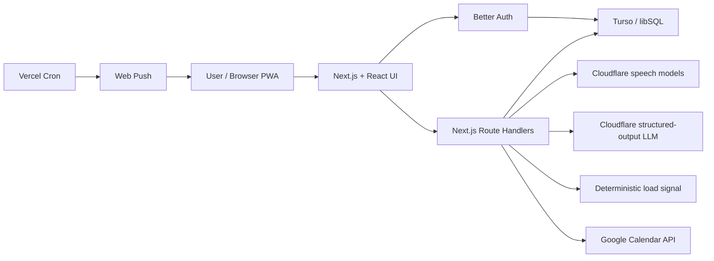
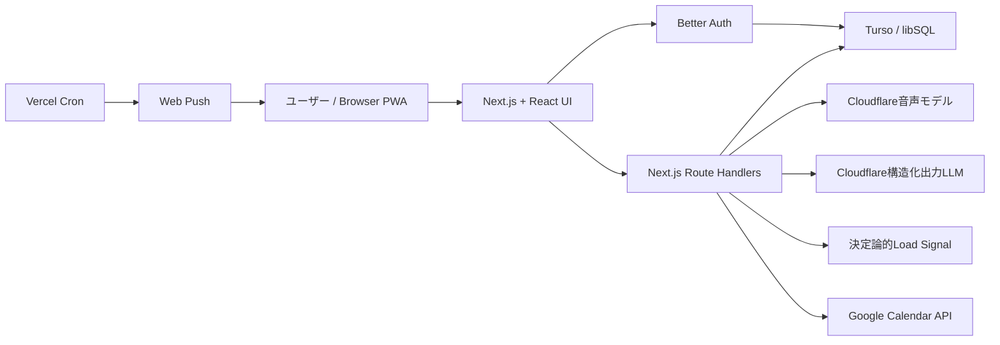

# Echly

- **Current version:** v0.4.1
- **Last README verification:** 2026-07-21
- **Public demo:** [https://echly.xyz](https://echly.xyz)

> **Language note:** English comes first in each section for international judges, followed by Japanese for Japanese reviewers and team handoff.

Echly is a voice-first AI planning assistant that turns an exhausted evening check-in into a realistic plan for tomorrow. It listens to what happened today, what needs to happen tomorrow, and how much capacity the user has, then helps reshape the next day before overwork becomes the default.

Echlyは、疲れている夜でも「話すだけ」で今日の振り返りと明日の予定を整理できる音声チェックイン型AIアシスタントです。今日の出来事、明日の予定、本人の余力をもとに、明日の仕事量を無理なく整えることを支援します。

**Tagline:** Your work should adapt to your capacity.

## 1. Overview（概要）

### English

When people are tired, even maintaining a task manager can feel like another task. Echly reduces that friction by letting users speak naturally: what they did today, what is coming tomorrow, what feels heavy, and what cannot move.

The product then:

1. Transcribes the voice input.
2. Extracts tasks, events, concerns, dates, times, people, importance, and movability.
3. Calculates a non-medical workload signal using deterministic TypeScript logic.
4. Generates a tomorrow plan that protects important commitments and creates recovery space.
5. Persists the result so users can revisit their plan, history, and workload trend.

The key product shift is from **reflection-only well-being** to **actionable workload adjustment**.

### 日本語

疲れている夜に、タスク管理ツールを開き、入力し、分類し、優先順位を付け直すこと自体が負担になります。Echlyは、その負担を「話すだけ」のチェックインに置き換えます。

ユーザーが「今日どうだったか」「明日何があるか」「何が重いか」「何は動かせないか」を話すと、Echlyは以下を行います。

1. 音声を文字起こしする。
2. タスク、予定、気がかり、日付、時刻、関係者、重要度、移動可否を抽出する。
3. 決定論的なTypeScriptロジックで、医学的診断ではない負荷シグナルを算出する。
4. 重要な予定を守りながら、回復の余白を入れた翌日プランを生成する。
5. 結果を保存し、履歴・プラン・負荷推移として後から確認できるようにする。

Echlyの価値は、単なる「状態の可視化」ではなく、**明日の仕事量を実際に調整する行動支援**にあります。

## 2. Problem（解決したい課題）

### English

- People need planning support most when they have the least energy to plan.
- Users often underestimate their own workload and carry too much into tomorrow.
- Well-being tools often visualize stress or mood, but do not reduce the work causing it.
- Productivity tools often require structured input, which collapses when the user is tired.
- Rescheduling meetings or drafting considerate messages has emotional cost, so people avoid it.

Echly turns a nightly reflection into decisions: what to keep, what to move, what to postpone, and where to create rest.

### 日本語

- 人は、計画を立てる余力が一番少ないときほど、計画支援を必要としている。
- 自分の負荷を過小評価したまま、翌日にも予定を詰め込んでしまう。
- ウェルビーイング系ツールは状態の可視化で止まり、原因である仕事量の調整までは踏み込まないことが多い。
- 生産性ツールは構造化入力を求めるため、疲れていると使い続けにくい。
- 会議の延期や連絡文の作成には心理的コストがあり、必要だと分かっていても後回しになりやすい。

Echlyは夜の振り返りを、「何を守るか」「何を動かすか」「何を延期するか」「どこで休むか」という判断に変換します。

## 3. Demo（デモ）

### English

**Public demo:** [https://echly.xyz](https://echly.xyz)

Routes:

- Automatic language selection: `https://echly.xyz`
- Japanese: `https://echly.xyz/jp-ja`
- English: `https://echly.xyz/us-en`

Recommended judging flow:

1. Sign in with Google or email/password.
2. Record or type today's reflection.
3. Record or type tomorrow's tasks and events.
4. Review and confirm the transcript.
5. Inspect extracted tasks and the workload signal evidence.
6. Generate tomorrow's plan.
7. Confirm the plan and check History.
8. Open Settings to review language switching, privacy, PWA installation, and notification controls.

Sample input:

```text
Tomorrow I have a budget meeting with Acme at 10 AM, need to finish the proposal deck in the afternoon, and have a brainstorm with Chris at 5 PM. I barely slept last night and I'm having trouble focusing.
```

### 日本語

**公開デモ:** [https://echly.xyz](https://echly.xyz)

ルート:

- 自動言語判定: `https://echly.xyz`
- 日本語: `https://echly.xyz/jp-ja`
- English: `https://echly.xyz/us-en`

推奨デモフロー:

1. Googleまたはメール／パスワードでログインする。
2. 今日の振り返りを録音またはテキスト入力する。
3. 明日の予定・タスクを録音またはテキスト入力する。
4. 文字起こしを確認して確定する。
5. 抽出タスクと負荷シグナルの根拠を確認する。
6. 翌日プランを生成する。
7. プランを確定し、履歴画面で保存結果を確認する。
8. 設定画面で言語切替、プライバシー、PWA導入、通知設定を確認する。

サンプル発話:

```text
明日は10時にA社の予算会議。午後は資料の仕上げ、17時からCさんとブレスト。でも、今日はほとんど寝てなくて、正直もう頭が回らない。
```

## 4. Implemented Features（実装済み機能）

### English

#### Voice and transcript flow

- Browser recording with the MediaRecorder API
- Separate inputs for today's reflection and tomorrow's plans
- Japanese and English transcription flow
- Transcript review and correction before analysis
- Audio metadata capture: duration, average volume, silence ratio, and derived speech rate
- Transcription quality checks using candidate confidence, speech probability, model agreement, and known silence-hallucination filtering

#### AI planning flow

- Structured task and event extraction from confirmed transcripts
- Extraction of title, kind, status, temporal context, date, start time, end time, deadline, people, importance, burden, and movability
- Tomorrow-only actionable task filtering before plan generation
- Schema-validated plan output with keep, move, reschedule, and rest-block sections
- Deterministic fallback plan generation when the live AI path fails in supported configuration/quota cases

#### Workload signal

- Six self-report workload questions inspired by Raw NASA-TLX dimensions
- Sleepiness input normalized from a KSS-style 1-9 scale
- Personal voice-baseline support using eligible historical recordings
- Robust personal deviation scoring with median and MAD-style scaling
- Dynamic voice weighting based on available features
- Non-medical disclaimer and evidence display

#### Product surface

- Better Auth authentication with Google OAuth and email/password
- Per-user Turso/libSQL persistence
- History list, daily detail pages, and transcript index
- Plans persisted by target date and restored after reload
- One-week and one-month workload trend charts
- Japanese/English route structure and browser language detection
- PWA manifest, Service Worker, icons, and browser-specific install guide
- Web Push evening reminders, conditional follow-up reminders, and optional 5-minute reminders before confirmed plan items
- Terms and privacy pages

#### Calendar support

- Google Calendar event read API when the connected account has the calendar events scope
- Existing Google Calendar events treated as busy blocks during planning
- Google Calendar sync API for confirmed plan items and rest blocks
- Approval preference stored per user

### 日本語

#### 音声・文字起こしフロー

- MediaRecorder APIによるブラウザ録音
- 今日の振り返りと明日の予定を分けた入力フロー
- 日本語・英語の文字起こし導線
- 解析前の文字起こし確認・修正UI
- 録音時間、平均音量、無音率、文字起こし後の話速などの音声メタデータ取得
- 信頼度、発話確率、モデル間一致、既知の無音ハルシネーション判定を使った文字起こし品質チェック

#### AIプランニングフロー

- 確定済み文字起こしからの構造化タスク・予定抽出
- タイトル、種別、状態、時間文脈、日付、開始時刻、終了時刻、期限、関係者、重要度、負担、移動可否を抽出
- 翌日に実行可能な未完了項目だけをプラン生成対象にするフィルタ
- 維持・移動・延期・休息ブロックを含むスキーマ検証済みプラン
- 設定不足や利用上限など、対応可能な障害時の決定論的フォールバック生成

#### 負荷シグナル

- Raw NASA-TLXの6次元を参考にした自己評価
- KSS風の1〜9段階眠気入力を0〜100へ正規化
- 有効な過去録音を使う個人内音声ベースライン
- 中央値とMAD風スケーリングによるロバストな個人内変化スコア
- 取得できた音声特徴に応じた動的な音声重み付け
- 医学的診断ではないことの明示と根拠表示

#### プロダクト面

- Better AuthによるGoogle OAuthとメール／パスワード認証
- Turso/libSQLへのユーザー別永続化
- 履歴一覧、日別詳細ページ、文字起こしインデックス
- 対象日ごとのプラン保存と再読み込み後の復元
- 1週間・1か月の負荷推移グラフ
- 日本語／英語ルートとブラウザ言語判定
- PWA manifest、Service Worker、各ブラウザ向け導入ガイド
- 夜のチェックイン通知、未完了時の再通知、確定予定の5分前通知
- 利用規約・プライバシーポリシーページ

#### Calendar対応

- Google Calendar events scopeがある接続アカウントでの予定読み取りAPI
- 既存Google Calendar予定をbusy時間としてプラン生成に反映
- 確定済みプラン項目と休息ブロックをGoogle Calendarへ同期するAPI
- カレンダー変更前確認設定のユーザー別保存

## 5. Technical Strengths（技術的な強み）

### English

1. **Deterministic scoring around AI:** LLMs extract and plan, but the workload score is calculated by reproducible TypeScript logic.
2. **Schema boundaries:** AI responses are validated with Zod before the UI or database accepts them.
3. **Transcription is not blindly trusted:** Echly compares transcription candidates and rejects likely silence hallucinations.
4. **Temporal safety:** Prompts and task filters separate past reflections, completed work, tomorrow actions, and future plans.
5. **Personal baseline instead of population judgment:** Voice trends compare a user with their own historical recordings, not with other people.
6. **Resilient demo path:** Supported AI configuration/quota failures degrade into a controlled fallback instead of a broken product flow.
7. **Privacy-aware persistence:** Raw audio is not stored; transcripts, derived features, plans, preferences, and notifications are stored per authenticated user.
8. **Real product completeness:** Authentication, persistence, history, PWA support, notifications, legal pages, and calendar APIs are present, not just a prototype screen.

### 日本語

1. **AIの周囲を決定論的ロジックで固めている:** LLMは抽出と提案に使い、負荷スコアは再現可能なTypeScriptロジックで計算する。
2. **Zodをシステム境界にしている:** AI出力はUIやDBへ入る前にZodで検証する。
3. **文字起こしを盲信しない:** 複数候補を比較し、無音ハルシネーションの可能性がある結果を拒否する。
4. **時間文脈の安全性:** 今日の完了報告、過去の振り返り、明日の未完了タスク、将来予定を混同しないようプロンプトとフィルタを分けている。
5. **集団比較ではなく個人内比較:** 音声傾向は他人平均との差ではなく、本人の過去記録との差だけを見る。
6. **デモ耐性:** 設定不足やクォータ上限など対応可能な障害では、制御されたフォールバックで主要導線を維持する。
7. **プライバシー前提の保存:** 生音声は保存せず、文字起こし、派生特徴、プラン、設定、通知情報を認証ユーザー単位で保存する。
8. **プロダクトとしての完成度:** 認証、永続化、履歴、PWA、通知、法務ページ、Calendar APIまで含めた実利用面を実装している。

## 6. Load Signal Method（負荷シグナルの独自基準と根拠）

### English

Echly Load Signal is not a medical score. It is a product-specific planning signal for deciding whether tomorrow should be protected, lightened, or buffered with recovery time.

The current implementation is `echly-load-v2` and combines three layers.

#### 1. Self-reported workload: Raw TLX-inspired

Echly asks six 0-100 self-report questions inspired by NASA-TLX dimensions:

- Mental demand
- Physical demand
- Temporal demand
- Dissatisfaction with performance
- Effort
- Frustration / anxiety

The six values are averaged as a Raw TLX-style daily workload component.

Why this is used:

- NASA-TLX is a widely used subjective workload framework.
- Raw TLX keeps the input short enough for a nightly consumer product.
- Echly clearly treats this as an adaptation, because NASA-TLX was originally designed around task-level workload, not a whole-day consumer check-in.

References used in the design:

- [Hart, 2006, NASA-TLX; 20 Years Later](https://doi.org/10.1177/154193120605000909)
- [NASA Task Load Index v1.0 manual](https://ntrs.nasa.gov/citations/20000021487)
- [NASA report on Raw TLX and weighted TLX correlation](https://ntrs.nasa.gov/api/citations/20020021642/downloads/20020021642.pdf)

#### 2. Sleepiness: KSS-style normalization

The user answers sleepiness on a 1-9 scale. Echly normalizes it to 0-100:

```text
Sleepiness = (KSS - 1) / 8 * 100
```

Why this is used:

- Sleepiness affects attention, reaction time, and planning capacity.
- It is kept as a supporting signal, not the main score.

Reference used in the design:

- [Kaida et al., 2006, validation of KSS against performance and EEG variables](https://pubmed.ncbi.nlm.nih.gov/16679057/)

#### 3. Personal voice trend: within-user only

Echly can use speech rate and pause/silence ratio only when enough eligible personal recordings exist. The implementation uses:

- Minimum current sample duration: 10 seconds
- Minimum baseline count: 5 eligible past recordings
- Features: speech rate and pause ratio when available
- Robust center: median
- Robust scale: MAD-style deviation with fallback scale
- Ordinary variation: one scale of change is treated as normal day-to-day variance

The voice signal is intentionally small. If both voice features are available and enough baseline exists, the maximum voice weight is 10%. If only one feature is usable, the voice weight is reduced.

Current combination:

```text
Without voice baseline:
Score = Raw TLX * 0.85 + Sleepiness * 0.15

With full voice baseline:
Score = Raw TLX * 0.75 + Sleepiness * 0.15 + Voice deviation * 0.10
```

Why this is defensible:

- Self-report remains the main signal because it is the most direct evidence available in this setting.
- Sleepiness is a small capacity-related modifier.
- Voice is used only as within-user change, because real-world voice stress indicators vary by person, microphone, language, task, and environment.
- If there is not enough evidence, the voice component is not used.

References used in the design:

- [Gorovoy et al., 2010, speech rate and pause features for cognitive load classification](https://proceedings.cmbes.ca/index.php/proceedings/article/view/538)
- [Vocal-Stress Diary, longitudinal daily work stressors and voice](https://doi.org/10.1177/09567976211068110)
- [2025 systematic review on variability in real-world voice indicators](https://pubmed.ncbi.nlm.nih.gov/40705747/)

#### Output bands

```text
0-39   Low to normal
40-59  Elevated
60-100 High
```

These are product thresholds, not clinical cutoffs and not official NASA-TLX bands. They are used to decide when Echly should start suggesting lighter planning and recovery blocks.

### 日本語

Echly Load Signalは医療スコアではありません。翌日を「そのまま進めるか」「軽くするか」「回復時間を先に確保するか」を判断するための、Echly独自の予定調整シグナルです。

現在の実装バージョンは `echly-load-v2` で、3つの層を組み合わせています。

#### 1. 自己評価: Raw TLX参考

EchlyはNASA-TLXの次元を参考に、0〜100の6項目を入力します。

- 精神的な要求
- 身体的な要求
- 時間的な切迫
- 達成度への不満
- 必要だった努力
- 不安・いらだち

この6項目の単純平均を、Raw TLX風の日次ワークロード成分として使います。

この設計にした理由:

- NASA-TLXは主観的ワークロード評価として広く使われている。
- Raw TLX形式にすることで、夜のチェックインで入力できる短さに保てる。
- ただしNASA-TLXは本来タスク単位の負荷評価であり、Echlyの日次チェックインへの適用は独自拡張であると明示する。

設計時に参照した資料:

- [Hart, 2006, NASA-TLX; 20 Years Later](https://doi.org/10.1177/154193120605000909)
- [NASA Task Load Index v1.0 manual](https://ntrs.nasa.gov/citations/20000021487)
- [Raw TLXと重み付きTLXの相関に関するNASA報告](https://ntrs.nasa.gov/api/citations/20020021642/downloads/20020021642.pdf)

#### 2. 眠気: KSS風の正規化

ユーザーは眠気を1〜9で回答し、Echlyは0〜100へ正規化します。

```text
Sleepiness = (KSS - 1) / 8 * 100
```

この設計にした理由:

- 眠気は注意、反応時間、計画能力に影響する。
- ただし主指標ではなく、補助的な容量シグナルとして扱う。

設計時に参照した資料:

- [Kaida et al., 2006, KSSとパフォーマンス・EEG指標の妥当性検証](https://pubmed.ncbi.nlm.nih.gov/16679057/)

#### 3. 音声傾向: 個人内比較のみ

Echlyは、有効な本人の過去録音がそろった場合だけ、話速と休止・無音率を補助的に使います。現在の実装は以下です。

- 現在録音の最小長: 10秒
- ベースラインに必要な過去記録数: 5件
- 使用特徴: 取得できた場合の話速と休止率
- 中心値: 中央値
- スケール: MAD風のロバスト偏差。MADが小さい場合は代替スケールを使用
- 通常変動: 1スケール分の変化は日常変動として無得点

音声の重みは意図的に小さくしています。2特徴がそろった場合でも最大10%、1特徴のみの場合は重みを下げます。

現在の合成式:

```text
音声ベースラインなし:
Score = Raw TLX * 0.85 + Sleepiness * 0.15

音声ベースラインあり:
Score = Raw TLX * 0.75 + Sleepiness * 0.15 + Voice deviation * 0.10
```

この設計が強い理由:

- 自己評価を主情報として扱うため、音声だけで状態を断定しない。
- 眠気は容量に関わる補助情報として小さく加える。
- 音声は、マイク、言語、性別、発話内容、環境、個人差の影響が大きいため、他人との比較ではなく本人の過去との差だけを見る。
- 根拠が足りない場合は音声成分を使わない。

設計時に参照した資料:

- [Gorovoy et al., 2010, speech rate / pause featuresによる認知負荷分類](https://proceedings.cmbes.ca/index.php/proceedings/article/view/538)
- [Vocal-Stress Diary, 日常の仕事ストレッサーと音声の縦断研究](https://doi.org/10.1177/09567976211068110)
- [2025 systematic review: 実環境音声指標の不一致と変動](https://pubmed.ncbi.nlm.nih.gov/40705747/)

#### 表示区分

```text
0-39   低〜通常
40-59  やや高い
60-100 高い
```

これは臨床カットオフでもNASA-TLX公式区分でもありません。翌日の予定削減や休息提案を開始するための製品上の境界です。

## 7. Tech Stack（技術構成）

### English

| Area | Technology |
| --- | --- |
| Web | Next.js 16 App Router, React 19, TypeScript |
| UI | HeroUI, Tailwind CSS v4, Lucide React |
| AI runtime | Cloudflare Workers AI |
| Default text model | `@cf/openai/gpt-oss-20b` |
| Speech-to-text | `@cf/deepgram/nova-3` with `@cf/openai/whisper-large-v3-turbo` fallback |
| AI output safety | Zod schemas, structured JSON parsing, fallback generation |
| Auth | Better Auth, Google OAuth, email/password |
| Database | Turso/libSQL, Kysely |
| Calendar | Google Calendar events and sync APIs |
| Notifications | Web Push, VAPID, Vercel Cron |
| PWA | Manifest, Service Worker, install guide assets |
| Tests | Node.js test runner, ESLint, TypeScript, production build |
| Deployment | Vercel |

OpenAI Node SDK is included as an optional client path in the repository, but the current live transcription, extraction, and planning routes use Cloudflare Workers AI.

### 日本語

| 分類 | 技術 |
| --- | --- |
| Web | Next.js 16 App Router、React 19、TypeScript |
| UI | HeroUI、Tailwind CSS v4、Lucide React |
| AI実行基盤 | Cloudflare Workers AI |
| 既定テキストモデル | `@cf/openai/gpt-oss-20b` |
| 音声文字起こし | `@cf/deepgram/nova-3`、フォールバック `@cf/openai/whisper-large-v3-turbo` |
| AI出力安全性 | Zodスキーマ、構造化JSON解析、フォールバック生成 |
| 認証 | Better Auth、Google OAuth、メール／パスワード |
| データベース | Turso/libSQL、Kysely |
| Calendar | Google Calendar予定取得・同期API |
| 通知 | Web Push、VAPID、Vercel Cron |
| PWA | Manifest、Service Worker、導入ガイド画像 |
| テスト | Node.js test runner、ESLint、TypeScript、本番ビルド |
| デプロイ | Vercel |

OpenAI Node SDKはリポジトリ内に任意のクライアント経路として含まれていますが、現在のライブな文字起こし・抽出・プラン生成ルートはCloudflare Workers AIを使用しています。

## 8. Architecture（アーキテクチャ）

### English



Flow:

1. Browser records audio and measures audio metadata.
2. Authenticated API routes handle transcription, extraction, planning, persistence, notification state, and optional calendar sync.
3. `/api/transcribe` selects the most reliable candidate and returns a review-required transcript.
4. `/api/analyze` extracts structured tasks and calculates the deterministic workload signal.
5. `/api/plan` generates and validates tomorrow's plan, then deterministic completion logic fixes missing or conflicting placements.
6. Workspace data is persisted per authenticated user in Turso/libSQL.

### 日本語



処理フロー:

1. ブラウザで録音し、音声メタデータを計測する。
2. 認証済みAPIルートが、文字起こし、抽出、プラン生成、永続化、通知状態、任意のCalendar同期を処理する。
3. `/api/transcribe` が信頼できる候補を選び、確認必須の文字起こしとして返す。
4. `/api/analyze` が構造化タスクを抽出し、決定論的な負荷シグナルを算出する。
5. `/api/plan` が翌日プランを生成・検証し、決定論的な補完ロジックが不足や衝突を補正する。
6. ワークスペースデータは認証済みユーザー単位でTurso/libSQLへ保存される。

## 9. Data And Privacy（データとプライバシー）

### English

Stored per authenticated user:

- Check-ins
- Confirmed transcripts
- Extracted tasks and events
- Workload answers and derived components
- Generated plans and approval status
- Added schedule entries
- Preferences
- Push subscriptions and plan-notification records

Tables created or upgraded by the app:

- `echly_check_ins`
- `echly_schedule_entries`
- `echly_history_transcripts`
- `echly_plans`
- `echly_user_preferences`
- `push_subscriptions`
- `push_plan_notifications`

Raw audio is not stored. Recordings are processed for transcription and derived features, then discarded.

### 日本語

認証済みユーザー単位で保存するもの:

- チェックイン
- 確定済み文字起こし
- 抽出されたタスク・予定
- 負荷自己評価と派生成分
- 生成プランと承認状態
- 追加された予定
- 設定
- Push購読情報と予定通知レコード

アプリが作成・更新するテーブル:

- `echly_check_ins`
- `echly_schedule_entries`
- `echly_history_transcripts`
- `echly_plans`
- `echly_user_preferences`
- `push_subscriptions`
- `push_plan_notifications`

生の録音音声は保存しません。録音は文字起こしと派生特徴の処理に使い、その後破棄します。

## 10. Setup（セットアップ）

### English

Prerequisites:

- Node.js 20.9 or later
- npm
- Turso database
- Google OAuth client
- Cloudflare account with Workers AI access
- Optional VAPID keys for Web Push

```bash
git clone https://github.com/NEXRO-dev/build-week-app.git
cd build-week-app/project
npm ci
cp .env.example .env.local
```

Generate a Better Auth secret:

```bash
openssl rand -base64 48
```

Run Better Auth migrations after filling `.env.local`:

```bash
npx auth@latest migrate
```

Echly workspace tables are created or upgraded automatically on the first authenticated workspace request.

For local Google OAuth, register:

```text
http://localhost:3000/api/auth/callback/google
```

### 日本語

前提:

- Node.js 20.9以降
- npm
- Tursoデータベース
- Google OAuthクライアント
- Cloudflare Workers AIを利用できるアカウント
- Web Pushを使う場合はVAPID鍵

```bash
git clone https://github.com/NEXRO-dev/build-week-app.git
cd build-week-app/project
npm ci
cp .env.example .env.local
```

Better Auth用のsecretを生成します。

```bash
openssl rand -base64 48
```

`.env.local` を設定したあと、Better Authのマイグレーションを実行します。

```bash
npx auth@latest migrate
```

Echly固有のワークスペーステーブルは、認証済みワークスペースへの初回アクセス時に自動作成・更新されます。

ローカルのGoogle OAuthには以下を登録します。

```text
http://localhost:3000/api/auth/callback/google
```

## 11. Environment Variables（環境変数）

```dotenv
# Authentication / database: required
BETTER_AUTH_URL=http://localhost:3000
BETTER_AUTH_SECRET=
GOOGLE_CLIENT_ID=
GOOGLE_CLIENT_SECRET=
TURSO_DATABASE_URL=
TURSO_AUTH_TOKEN=

# Runtime AI: required for live transcription and planning
CLOUDFLARE_ACCOUNT_ID=
CLOUDFLARE_API_TOKEN=
CLOUDFLARE_TEXT_MODEL=@cf/openai/gpt-oss-20b
CLOUDFLARE_TRANSCRIPTION_MODEL=@cf/deepgram/nova-3
CLOUDFLARE_TRANSCRIPTION_FALLBACK_MODEL=@cf/openai/whisper-large-v3-turbo

# Optional OpenAI client path
OPENAI_API_KEY=
OPENAI_TEXT_MODEL=
OPENAI_TRANSCRIPTION_MODEL=gpt-4o-mini-transcribe

# Web Push: required only when notifications are enabled
NEXT_PUBLIC_VAPID_PUBLIC_KEY=
VAPID_PRIVATE_KEY=
VAPID_SUBJECT=mailto:notifications@example.com
CRON_SECRET=
```

Generate VAPID keys / VAPID鍵の生成:

```bash
npx web-push generate-vapid-keys
```

Do not commit `.env.local` or expose server secrets to client-side code.

`.env.local` をコミットしたり、サーバー用secretをクライアントコードに公開したりしないでください。

## 12. Running And Testing（起動とテスト）

### English

Run locally:

```bash
npm run dev
```

Local URLs:

```text
http://localhost:3000
http://localhost:3000/jp-ja
http://localhost:3000/us-en
```

Production build:

```bash
npm run build
npm run start
```

Automated checks:

```bash
node --test tests/*.test.mjs
npm run lint
npx tsc --noEmit
npm run build
```

Current tests cover reflection-window rules, transcription quality, silence-hallucination handling, browser-language detection, Google Calendar busy-time planning, notification timing, and five-minute plan reminders.

### 日本語

ローカル起動:

```bash
npm run dev
```

ローカルURL:

```text
http://localhost:3000
http://localhost:3000/jp-ja
http://localhost:3000/us-en
```

本番ビルド:

```bash
npm run build
npm run start
```

自動チェック:

```bash
node --test tests/*.test.mjs
npm run lint
npx tsc --noEmit
npm run build
```

現在のテストは、振り返り受付時間、文字起こし品質、無音ハルシネーション対策、ブラウザ言語判定、Google Calendarのbusy時間を考慮したプラン生成、通知時刻、予定の5分前通知を検証しています。

## 13. Repository Structure（リポジトリ構成）

```text
project/
├── app/
│   ├── [locale]/              # localized page routes
│   └── api/                   # auth, AI, calendar, notification, workspace APIs
├── components/
│   ├── analysis/              # analysis result UI
│   ├── approval/              # approval flow
│   ├── auth/                  # sign-in / sign-up
│   ├── check-in/              # recording, self-report, transcript review
│   ├── history/               # daily history and detail views
│   ├── layout/                # app shell and navigation
│   ├── notifications/         # notification controls
│   ├── plan/                  # tomorrow plan UI
│   └── settings/              # account, privacy, PWA, notification settings
├── docs/
│   ├── history-storage.md
│   └── load-signal-v1.md
├── lib/
│   ├── audio/                 # audio features and transcription quality
│   ├── cloudflare/            # Workers AI client
│   ├── date/                  # local date and time-zone logic
│   ├── demo/                  # sample data and fallback behavior
│   ├── google-calendar/       # event reads and plan sync
│   ├── load/                  # deterministic workload signal
│   ├── notifications/         # Web Push scheduling and delivery
│   ├── openai/                # prompts, schemas, optional OpenAI client
│   ├── plan/                  # deterministic plan completion and time correction
│   ├── tasks/                 # time and temporal-context normalization
│   └── workspace/             # Turso persistence
├── public/                    # PWA icons, Service Worker, guide images
├── tests/                     # Node.js unit tests
├── types/                     # domain types
└── vercel.json                # cron configuration
```

## 14. Current Limitations（現在の制約）

### English

- Echly is not a medical device and does not diagnose stress, depression, burnout, sleep disorders, or any illness.
- The workload signal is an unvalidated product signal, not a clinical or official NASA-TLX score.
- Gmail draft creation is not implemented yet.
- Google Calendar APIs exist, but a complete visible connection/reconnection UI may not be available in every demo environment.
- Calendar sync depends on OAuth scope availability.
- Live AI requires Cloudflare Workers AI credentials.

### 日本語

- Echlyは医療機器ではなく、ストレス、うつ、バーンアウト、睡眠障害、疾患を診断しません。
- 負荷シグナルは未検証の製品内指標であり、臨床スコアやNASA-TLX公式スコアではありません。
- Gmail下書き作成は未実装です。
- Google Calendar APIは存在しますが、デモ環境によっては完全な接続・再接続UIが表示されない場合があります。
- Calendar同期はOAuth scopeの有無に依存します。
- ライブAI処理にはCloudflare Workers AIの認証情報が必要です。

## 15. Why It Can Win（賞を狙えるポイント）

### English

- **Clear user pain:** planning breaks exactly when people are tired, and Echly attacks that moment directly.
- **Voice-first interaction:** it removes the form-filling burden from the highest-friction moment of the day.
- **Action beyond visualization:** it does not just show overload; it changes tomorrow's plan.
- **Technically credible AI:** deterministic scoring, Zod boundaries, transcription quality checks, and temporal filters reduce common LLM failure modes.
- **Original workload design:** the load signal combines validated inspirations with conservative product-specific boundaries.
- **Privacy-aware by default:** raw audio is not stored, and sensitive outputs require review.
- **Product completeness:** auth, persistence, PWA, notifications, history, legal pages, and calendar APIs make it feel like a real service, not only a demo.

### 日本語

- **課題が明確:** 疲れているときほど計画が破綻する、という瞬間に直接向き合っている。
- **音声ファースト:** 一日の中で最も摩擦が高いタイミングから、フォーム入力の負担を取り除いている。
- **可視化で終わらない:** 負荷を見せるだけでなく、明日の予定を実際に軽くする提案まで行う。
- **AI実装に信頼性がある:** 決定論的スコア、Zod境界、文字起こし品質判定、時間文脈フィルタでLLMの失敗を抑えている。
- **独自の負荷設計:** 既存研究を参考にしつつ、製品上の安全な境界として独自指標に落としている。
- **プライバシー前提:** 生音声を保存せず、重要な出力はユーザー確認を通す。
- **プロダクト完成度:** 認証、永続化、PWA、通知、履歴、法務ページ、Calendar APIまであり、単なる画面デモではなくサービスとして見える。

## 16. Roadmap（今後の展望）

### English

- Add a visible Google Calendar connection and reconnection flow.
- Save approved Gmail drafts without automatic sending.
- Add audit logs for approval and external sync results.
- Let users correct workload results and use that feedback to improve suggestions.
- Improve long-term baseline visualization and schedule-density analysis.
- Expand E2E, accessibility, and speech-recognition evaluation coverage.
- Add offline recording and retry queues.
- Validate whether the voice component improves next-day planning outcomes beyond Raw TLX and sleepiness alone.

### 日本語

- Google Calendarの接続・再接続フローをUIとして明示する。
- 承認済みGmail下書きを、自動送信なしで保存できるようにする。
- 承認結果と外部同期結果の監査ログを追加する。
- ユーザーが負荷判定を訂正し、そのフィードバックを提案改善に使えるようにする。
- 長期ベースライン可視化と予定密度分析を改善する。
- E2E、アクセシビリティ、音声認識評価のテストを拡充する。
- オフライン録音と再送キューを追加する。
- 音声成分がRaw TLXと眠気だけの場合より、翌日の計画結果を改善するか検証する。

## 17. License（ライセンス）

### English

This repository currently does not include a license file. Unless explicit permission is granted by the copyright holder, copying, modification, and redistribution are not licensed. Add a `LICENSE` file and update this section before open-source publication if needed.

### 日本語

現在、このリポジトリにはライセンスファイルが含まれていません。そのため、著作権者から明示的な許可を得ない限り、コードの複製・変更・再配布は許諾されていません。オープンソースとして公開する場合は、公開前に `LICENSE` ファイルと本節を更新してください。